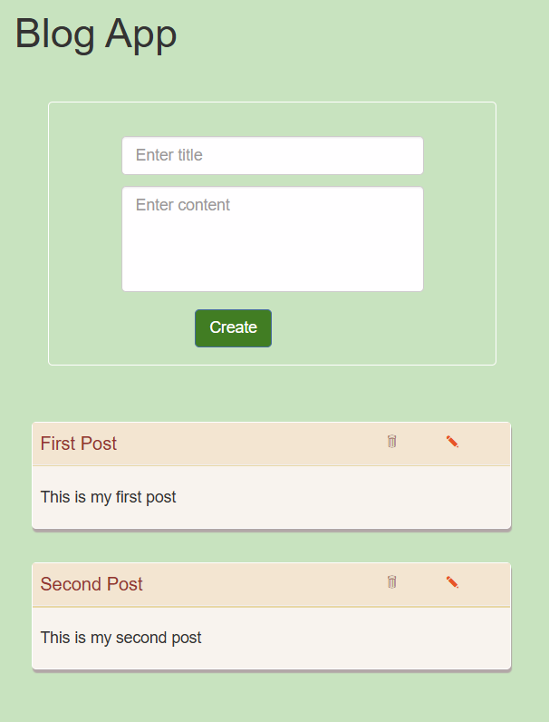

📝 Blog App

A simple Blog Application built with HTML, CSS, JavaScript, and Bootstrap 3.
This app allows users to create, edit, and delete blog posts. Data is saved in LocalStorage, so posts remain available even after refreshing the page.

✨ Features

➕ Add new blog posts

✏️ Edit existing posts

❌ Delete posts

💾 Data persistence with LocalStorage

🎨 Responsive design using Bootstrap 3

🛠️ Technologies Used

HTML5

CSS3

Bootstrap 3

JavaScript (ES6)

LocalStorage

🚀 How to Use

1. Clone the repository:

git clone https://github.com/your-username/blog-app.git

2. Open index.html in your browser.

3. Start adding, editing, or deleting posts.

📸 Screenshots

---

🔮 Future Improvements

Add search functionality

Add categories or tags for posts

Option to save posts in a backend database

Author 
Raziyeh
